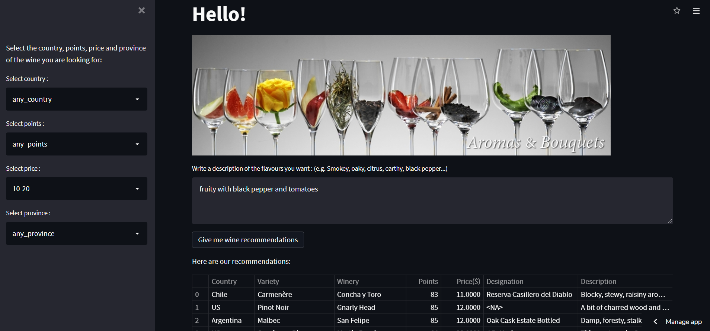

# Wine-Recommender-app
You can interact with this app here:    
 
 
This is a recommender app that gives wine recommendation based on user attribute selection and a worded description of flavours.  
It takes user selections about different wine attributes and also takes user flavour description as inputs.  
Then it gives the recommendations based on a combinations of both inputs where it weighs descriptive inputs more.  
 

